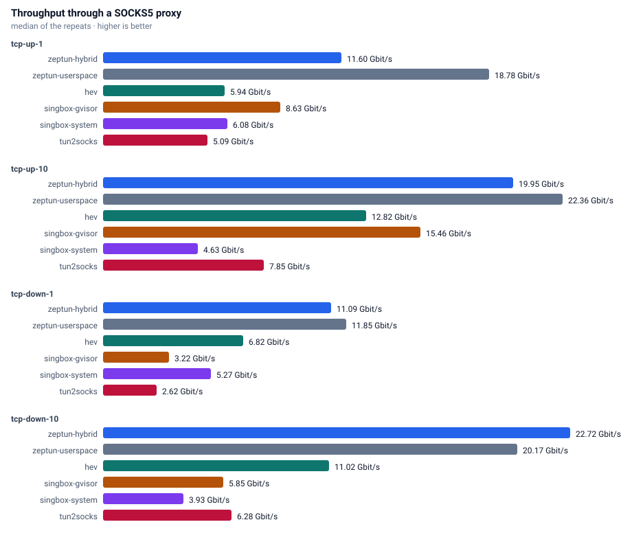
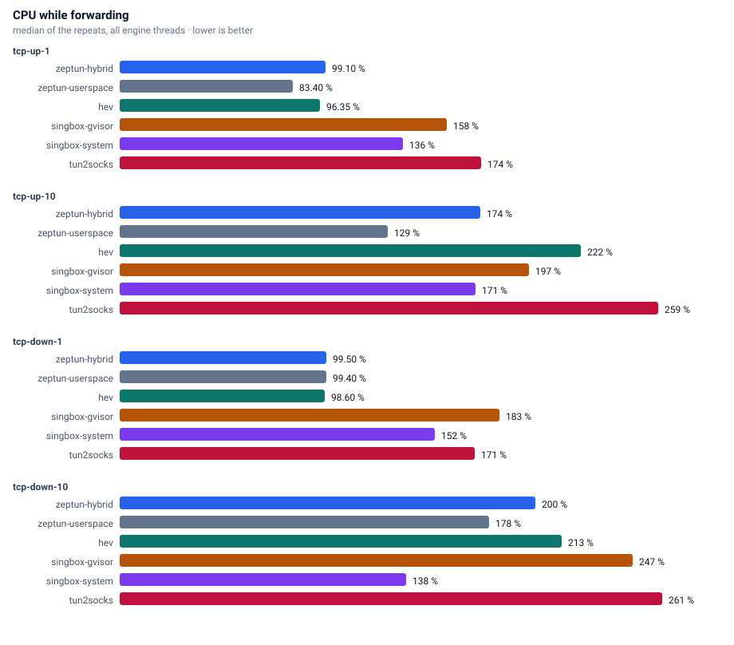
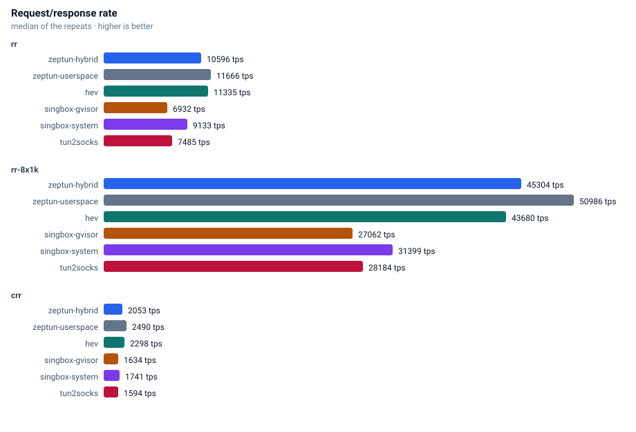
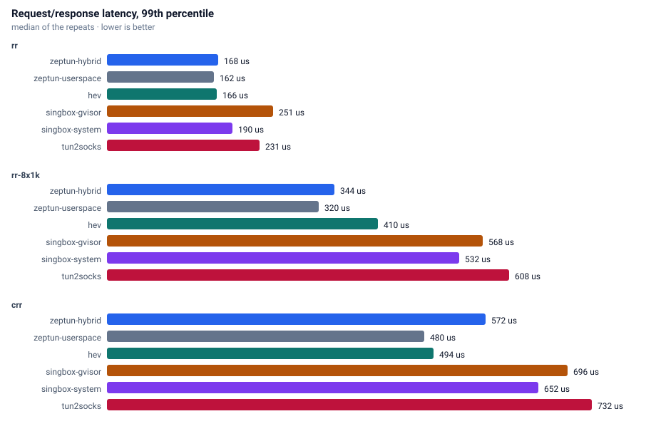
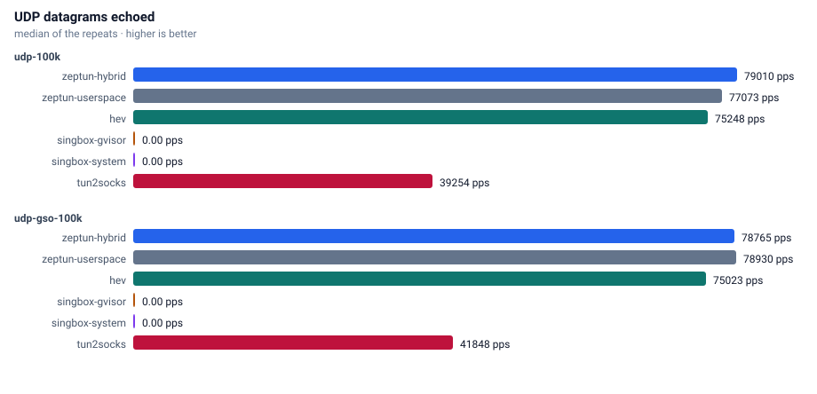
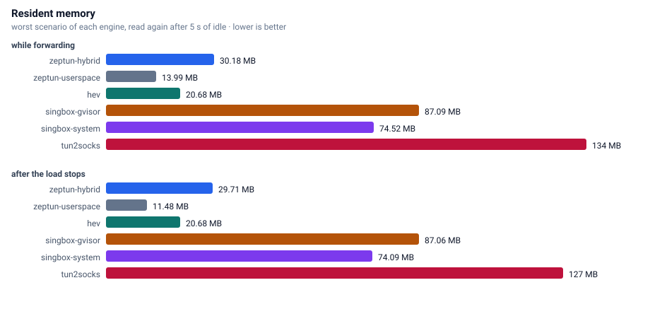

# Benchmarks

Every number on this page comes from the `benchmark` workflow in this repository, run on a GitHub-hosted runner.

## Machine

| property | value |
|---|---|
| runner image | ubuntu24 20260920.314.1 |
| cpu | AMD EPYC 7763 64-Core Processor |
| cpu cores | 4 |
| memory | 15.6 GB |
| kernel | Linux 6.17.0-1022-azure |
| zig | 0.16.0 |
| date | 2026-09-27 |

## Method

Two network namespaces joined by a veth pair. Traffic enters the tunnel device (MTU 8500), leaves through the same SOCKS5 server (hev-socks5-server) for every engine, and reaches the servers in the second namespace. Engines are interleaved: each round starts every engine once and runs every scenario against it, so background noise spreads evenly. CPU comes from `/proc/<pid>/stat` and memory from `VmRSS`, summed over all processes of an engine.

Duration 8 s per scenario, 2 rounds, 4 queues. Memory is read twice: the highest sample while the scenario runs, and again after 5 s of idle, which shows whether an engine gives the memory back.

## Throughput

## CPU

## Request/response

## UDP

## Memory

## Raw results

| engine | scenario | median | cpu % | max rss MB | rss after idle MB |
|---|---|---:|---:|---:|---:|
| zeptun-userspace | tcp-up-1 | 18.935 Gbit/s | 82 | 8.8 | 7.4 |
| zeptun-userspace | tcp-up-10 | 22.560 Gbit/s | 128 | 13.2 | 7.9 |
| zeptun-userspace | tcp-down-1 | 12.384 Gbit/s | 99 | 12.6 | 12.3 |
| zeptun-userspace | tcp-down-10 | 20.228 Gbit/s | 175 | 16.0 | 12.4 |
| zeptun-userspace | rr | 7407 tps p50=128us p99=168us p99.9=190us  | 36 | 12.5 | 12.4 |
| zeptun-userspace | rr-8x1k | 33175 tps p50=232us p99=436us p99.9=560us  | 94 | 12.5 | 12.4 |
| zeptun-userspace | crr | 2015 tps p50=480us p99=552us p99.9=632us  | 44 | 12.6 | 12.5 |
| zeptun-userspace | udp-100k | 80364 echo pps (80.4% of 99992 sent)  | 74 | 13.5 | 12.6 |
| zeptun-userspace | udp-gso-100k | 79618 echo pps (79.6% of 99984 sent)  | 54 | 13.5 | 12.5 |
| hev | tcp-up-1 | 6.005 Gbit/s | 95 | 14.7 | 14.6 |
| hev | tcp-up-10 | 13.170 Gbit/s | 214 | 16.2 | 15.3 |
| hev | tcp-down-1 | 6.919 Gbit/s | 99 | 15.4 | 15.3 |
| hev | tcp-down-10 | 11.062 Gbit/s | 211 | 16.1 | 15.3 |
| hev | rr | 7192 tps p50=130us p99=174us p99.9=196us  | 39 | 15.4 | 15.3 |
| hev | rr-8x1k | 34770 tps p50=218us p99=420us p99.9=536us  | 128 | 15.9 | 15.3 |
| hev | crr | 1766 tps p50=552us p99=624us p99.9=848us  | 65 | 15.5 | 15.3 |
| hev | udp-100k | 75940 echo pps (76.0% of 99956 sent)  | 99 | 18.0 | 18.0 |
| hev | udp-gso-100k | 74970 echo pps (75.0% of 99992 sent)  | 98 | 20.7 | 20.7 |
| zeptun-hybrid | tcp-up-1 | 11.604 Gbit/s | 99 | 6.0 | 5.8 |
| zeptun-hybrid | tcp-up-10 | 20.265 Gbit/s | 168 | 13.5 | 12.6 |
| zeptun-hybrid | tcp-down-1 | 12.867 Gbit/s | 99 | 12.8 | 12.2 |
| zeptun-hybrid | tcp-down-10 | 22.940 Gbit/s | 201 | 13.6 | 12.7 |
| zeptun-hybrid | rr | 6674 tps p50=142us p99=184us p99.9=206us  | 40 | 14.4 | 16.3 |
| zeptun-hybrid | rr-8x1k | 30032 tps p50=256us p99=492us p99.9=632us  | 140 | 16.4 | 18.1 |
| zeptun-hybrid | crr | 1571 tps p50=616us p99=736us p99.9=880us  | 69 | 24.9 | 24.7 |
| zeptun-hybrid | udp-100k | 79978 echo pps (80.0% of 99988 sent)  | 95 | 28.9 | 28.5 |
| zeptun-hybrid | udp-gso-100k | 79838 echo pps (79.8% of 99992 sent)  | 55 | 32.7 | 32.2 |
| singbox-system | tcp-up-1 | 6.111 Gbit/s | 155 | 64.0 | 64.0 |
| singbox-system | tcp-up-10 | 4.652 Gbit/s | 172 | 64.4 | 64.4 |
| singbox-system | tcp-down-1 | 5.333 Gbit/s | 152 | 64.6 | 63.9 |
| singbox-system | tcp-down-10 | 3.948 Gbit/s | 138 | 64.3 | 64.3 |
| singbox-system | rr | 5575 tps p50=174us p99=212us p99.9=616us  | 61 | 64.3 | 64.3 |
| singbox-system | rr-8x1k | 22208 tps p50=344us p99=688us p99.9=944us  | 156 | 64.1 | 64.1 |
| singbox-system | crr | 1295 tps p50=760us p99=864us p99.9=1504us  | 101 | 73.4 | 73.4 |
| singbox-system | udp-100k | 0 echo pps (0.0% of 100000 sent)  | 86 | 75.6 | 74.7 |
| singbox-system | udp-gso-100k | 0 echo pps (0.0% of 99988 sent)  | 75 | 74.9 | 74.6 |
| tun2socks | tcp-up-1 | 5.092 Gbit/s | 173 | 19.6 | 19.1 |
| tun2socks | tcp-up-10 | 7.866 Gbit/s | 258 | 40.4 | 40.4 |
| tun2socks | tcp-down-1 | 2.653 Gbit/s | 172 | 42.5 | 25.3 |
| tun2socks | tcp-down-10 | 6.299 Gbit/s | 264 | 131.6 | 131.7 |
| tun2socks | rr | 4629 tps p50=216us p99=252us p99.9=320us  | 73 | 134.3 | 134.3 |
| tun2socks | rr-8x1k | 18554 tps p50=412us p99=816us p99.9=1104us  | 168 | 136.3 | 130.7 |
| tun2socks | crr | 1205 tps p50=800us p99=1008us p99.9=2272us  | 92 | 130.7 | 41.5 |
| tun2socks | udp-100k | 41094 echo pps (41.1% of 99972 sent)  | 215 | 54.5 | 65.7 |
| tun2socks | udp-gso-100k | 43940 echo pps (43.9% of 99992 sent)  | 229 | 65.5 | 67.1 |
| singbox-gvisor | tcp-up-1 | 9.077 Gbit/s | 146 | 72.2 | 72.2 |
| singbox-gvisor | tcp-up-10 | 15.497 Gbit/s | 199 | 82.5 | 81.6 |
| singbox-gvisor | tcp-down-1 | 3.233 Gbit/s | 183 | 82.9 | 82.9 |
| singbox-gvisor | tcp-down-10 | 5.899 Gbit/s | 249 | 89.3 | 89.3 |
| singbox-gvisor | rr | 4412 tps p50=224us p99=324us p99.9=360us  | 80 | 89.3 | 81.9 |
| singbox-gvisor | rr-8x1k | 17418 tps p50=440us p99=840us p99.9=1216us  | 169 | 75.9 | 75.8 |
| singbox-gvisor | crr | 1157 tps p50=840us p99=1024us p99.9=1744us  | 104 | 79.9 | 79.9 |
| singbox-gvisor | udp-100k | 0 echo pps (0.0% of 99996 sent)  | 169 | 80.0 | 79.4 |
| singbox-gvisor | udp-gso-100k | 0  | 0 | 79.4 | 79.4 |

zeptun: startup 4 ms, idle 2876 KB, 4 wakeups in 20 s | tcp 1000: 5184 KB (conns: 1000/1000 established, 0 failed, 1773 conn/s) | udp 1000: 5736 KB (udp flows: 1000/1000 answered, 8625 flows/s)
hev: startup 3 ms, idle 2221 KB, 2 wakeups in 20 s | tcp 1000: 78794 KB (conns: 1000/1000 established, 0 failed, 1892 conn/s) | udp 1000: 27322 KB (udp flows: 1000/1000 answered, 7220 flows/s)
singbox-system: startup 50 ms, idle 57981 KB, 6 wakeups in 20 s | tcp 1000: 73500 KB (conns: 1000/1000 established, 0 failed, 1357 conn/s) | udp 1000: 70336 KB (udp flows: 0/1000 answered, 0 flows/s)
singbox-gvisor: startup 50 ms, idle 61129 KB, 123 wakeups in 20 s | tcp 1000: 96520 KB (conns: 1000/1000 established, 0 failed, 1261 conn/s) | udp 1000: 101784 KB (udp flows: 0/1000 answered, 0 flows/s)
tun2socks: startup 5 ms, idle 15844 KB, 207 wakeups in 20 s | tcp 1000: 111368 KB (conns: 1000/1000 established, 0 failed, 1219 conn/s) | udp 1000: 185808 KB (udp flows: 1000/1000 answered, 4201 flows/s)
